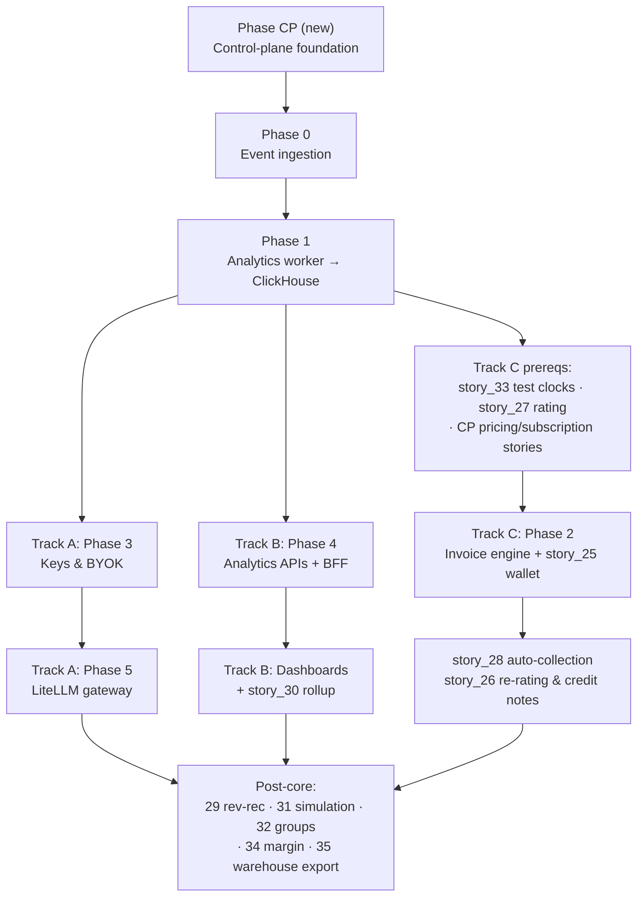

# QuantumBilling — Build Plan

**Status:** Proposed · 2026-07-01
**Companions:** [ADR-001](ARCHITECTURE_DECISION.md) (architecture) · [ERD.md](ERD.md) (schema)
**Purpose:** Dependency-correct build sequence. The backend docs' linear Phase 0→1→2→3→4→5 order predates ADR-001 and is wrong in three places: it lacks a control-plane phase (now a hard prerequisite of Phase 0 per ADR-001 §2.1), it places Phase 2 too early (it has the widest dependency fan-in and nothing depends on it), and it places Phase 3 too late (it gates real ingest auth and all of Phase 5). This plan replaces the linear order with a spine plus three parallel tracks.

---

## 1. Sequencing principles

1. **Dependencies only.** A phase starts when its inputs exist, not when its chapter number comes up.
2. **Meter before you bill.** ClickHouse retains every event immutably, and the invoice purity invariant (ADR-001 §3.4) makes invoices reproducible from history — so metering can go live months before invoicing ships, and Phase 2 bills retroactively from day-one data. Revenue capture is never blocked by the hardest component.
3. **One-writer rule shapes staffing.** Control plane (NestJS), event engine (Go), and gateway (Python/LiteLLM) touch disjoint tables — the three tracks can be three workstreams with no merge conflicts by construction.

## 2. Phase graph

Critical path: **CP → 0 → 1 → Track C → first invoice.** Tracks A and B never block it.

## 3. The spine

### Phase CP — Control-plane foundation *(new — no existing phase doc)*

The engine dropped its duplicate identity tables (ADR-001 §2.1); Phase 0's Redis existence caches warm from the canonical tables, so this phase gates everything.

| # | Work | Source stories |
|---|---|---|
| CP-1 | Prisma migrations: `identity.*`, `customer.customers`/`end_users`, minimal `catalog.*` | ERD §1–3 |
| CP-2 | Keycloak realm `quantumbilling`, roles, JWT validation in NestJS | organization story |
| CP-3 | Org/customer/end-user CRUD + onboarding | organization, onboarding, customer, customer_management, end_user_management stories |
| CP-4 | Write-through population of Redis existence caches (`org:{org_id}`, `org:{org_id}:enduser:{end_user_id}`) | backend story_3 (consumer side) |

**Exit:** an org, customer, and end user can be created via API and appear in Redis caches.
**Not needed yet:** pricing, rate cards, subscriptions, payments — those gate Track C, not Phase 0.

### Phase 0 — Event ingestion (as specced)

Ingest API, Kafka (KRaft, `usage-events` ×32), Redis auth/idempotency, batch ingest. API keys **seeded via script** until Phase 3 ships the key-creation APIs — acceptable for dev/staging only.
**Exit:** seeded key authenticates; single + 50k-batch ingest land in Kafka; duplicate `event_id` → 409.

### Phase 1 — Analytics worker (as specced)

Kafka → ClickHouse `events.usage_events` (+ dedup view). From this moment every event is durably retained — the retroactive-billing clock starts here.
**Exit:** sustained load lands in ClickHouse with dedup verified; the three tracks unblock.

## 4. The tracks (parallel after Phase 1)

### Track A — Real traffic *(Go + Python)*

| Order | Work | Notes |
|---|---|---|
| A-1 | Phase 3: key generation/revocation (stories 11–12), BYOK (13), security audit (14) | Replaces seeded keys; KMS envelope encryption per ADR-001 §7 before prod |
| A-2 | Phase 5: LiteLLM deployment, key sync (20), usage callback (21), budget sync (22), BYOK routing (23), gateway ops (24) | Callback posts renamed fields (`customer_id`/`end_user_id`) |

**Exit / Milestone M1:** a real LLM request through the gateway is metered end-to-end into ClickHouse.

### Track B — Visibility *(Go + NestJS + React)*

| Order | Work | Notes |
|---|---|---|
| B-1 | Phase 4: analytics APIs (stories 15–19) with BFF service auth | Paths use `/v1/customers/...` per rename |
| B-2 | NestJS BFF proxy + dashboards: org overview, team usage, platform analytics, end-user dashboard/events | All read via phase-4, none via Postgres |
| B-3 | story_30 usage-summary rollup job | Feeds limits UI + portal displays |

**Exit / Milestone M2:** all five dashboards render live ClickHouse data through the BFF.

### Track C — Money *(Go + NestJS)* — the critical path

| Order | Work | Notes |
|---|---|---|
| C-1 | story_33 test clocks | Before the worker: period logic is untestable without it |
| C-2 | story_27 rate resolution engine | Pure waterfall resolver + rating-exceptions report |
| C-3 | CP extension: pricing, rate cards, contracts, subscriptions, plans stories (NestJS) | Track C's config inputs; can start alongside C-1/C-2 |
| C-4 | Phase 2 core: consumer + counters (36), enforcement API (37), credits/FEFO (38), invoice engine (39) | Anniversary windows, typed line items, snapshots, draft/grace/finalize |
| C-5 | story_25 wallet & auto top-up | Needs 36 (hot path) + Stripe, not the invoice engine — can ship mid-track |
| C-6 | story_28 auto-collection + dunning + reconciliation | First collected revenue |
| C-7 | story_26 re-rating & credit notes | Completes the correction loop |

**Milestone M3** (after C-4 stories 36–37 + C-5): real-time enforcement + prepaid wallet live — revenue via prepaid before invoicing exists.
**Milestone M4** (after C-4 complete): first reproducible invoice, generated retroactively over ClickHouse history on a test clock.
**Milestone M5** (after C-6/C-7): auto-collected, correctable billing.

## 5. Post-core (any order after M4/M5)

story_29 rev-rec ledger · story_31 pricing simulation · story_32 billing groups · story_34 margin analytics · story_35 warehouse export — plus uiflow stories that present them (reports, credits UI extensions, webhooks new event types, AI chatbot, AI recommendations, alerts).

## 6. Story-to-phase map

| Phase/Track | Backend stories | Uiflow stories |
|---|---|---|
| CP | — (story_3 consumer side) | organization, onboarding, customer, customer_management, end_user_management |
| 0 | 1, 2, 3, 4, 5, 6 | meter (facade endpoint) |
| 1 | 7, 8, 9, 10 | — |
| A | 11, 12, 13, 14, 20, 21, 22, 23, 24 | developer_portal, api_key_management |
| B | 15, 16, 17, 18, 19, 30 | org overview, team usage, platform analytics, end-user dashboard/events, usage_limits (display) |
| C | 33, 27, 36–40 (phase_2-local), 25, 28, 26 | pricing, rate_cards, contract, subscription, invoice, payment, payment_method_management, dunning, tax_and_currency, credits, customer_portal |
| Post | 29, 31, 32, 34, 35 | reports, webhook, alerts, ai_recommendations, ai_chatbot, audit_and_compliance, entitlement stories, rate_limiting |

## 7. Open sequencing risks

1. **Phase CP has no phase doc** — this plan is its only spec; author one before kickoff if a doc-per-phase convention matters.
2. **Stripe account/config** gates C-5/C-6 and nothing else — provision early, it's pure lead time.
3. **KMS decision** (ADR-001 §7) gates Track A production cutover, not development.
4. **Flink vs Go aggregator** (ADR-001 §7) affects only the optional real-time agg topics — deferrable past M4.
