# QuantumBilling — Complete Billing Flow Overview

A comprehensive end-to-end guide to how usage-based billing, invoicing, and collections work in QuantumBilling.

---

## Complete Billing Flow

```mermaid
flowchart TB
    subgraph Setup["1. SETUP (ORG_ADMIN configures)"]
        M[Meters<br/>define what to track]
        P[Products<br/>define SKUs/catalogue]
        PM[Pricing Models<br/>FLAT / PER_UNIT / TIERED]
        RC[Rate Cards<br/>versioned meter→price mappings]
        UL[Usage Limits<br/>SOFT / HARD caps]
    end

    subgraph Customer["2. CUSTOMER ONBOARDING"]
        C[Customer<br/>created with credit_balance + health_score]
        CT[Contract<br/>commit_amount, auto_renew, linked rate card]
        E[Entitlements<br/>feature grants + usage limits]
    end

    subgraph Ingest["3. USAGE INGESTION (real-time)"]
        EV[End User Events<br/>API calls with tokens, latency, cost]
        MS[Meter Events<br/>POST /meters/:id/events with idempotency]
        US[Usage Summary<br/>aggregated per customer/meter/end_user]
    end

    subgraph Enforce["4. ENFORCEMENT"]
        LC[Limit Check<br/>API gateway calls /entitlements/check]
        SF[SOFT limit → X-QB-Usage-Warning header]
        HD[HARD limit → HTTP 429 blocked]
    end

    subgraph Bill["5. BILLING ENGINE (periodic)"]
        IG[Invoice Generation<br/>per subscription, per billing period]
        IL[Invoice Line Items<br/>usage charges + plan base fee + overage]
        CR[Credits Applied<br/>FEFO priority: compensation→promo→prepaid→commit]
        TX[Tax + Total Calculation]
    end

    subgraph Collect["6. COLLECTION"]
        PMT[Payment Recording<br/>full or partial]
        INV[Invoice States<br/>draft→pending→paid / overdue→voided]
        DUN[Dunning<br/>automated retry: EMAIL→SMS→SUSPEND→ESCALATE]
    end

    Setup --> Customer --> Ingest --> Enforce --> Bill --> Collect
```



---

### 1. Setup Phase

| Step | What happens | Who |
|------|-------------|-----|
| **Meters** | Define what to measure: `event_type`, `aggregation` (SUM/COUNT/AVG/GAUGE), `field`. State: `DRAFT → ACTIVE → INACTIVE` | ORG_ADMIN |
| **Products** | Create catalogue items (STANDALONE / ADD_ON / BUNDLE), each with a unique SKU. Must be linked to at least one Plan before publishing. State: `DRAFT → ACTIVE → INACTIVE → ARCHIVED` | ORG_ADMIN |
| **Pricing Models** | Define how to charge: `FLAT` (fixed fee), `PER_UNIT` (rate × quantity), or `TIERED` (volume bands with different rates). State: `DRAFT → ACTIVE → ARCHIVED` | ORG_ADMIN |
| **Rate Cards** | Versioned collections of `meter_id → rate` mappings. Contracts reference rate cards; contract-specific rates override rate card rates. Supports cost preview. | ORG_ADMIN |
| **Usage Limits** | Per-customer, per-meter caps: `SOFT` (warn only) or `HARD` (block). Supports per-customer overrides. Period can be `PER_MONTH`, `PER_YEAR`, or `LIFETIME`. | ORG_ADMIN |

### 2. Customer Onboarding

| Step | What happens |
|------|-------------|
| **Customer** | Created with `credit_balance=0`, `health_score=100`, `status=ACTIVE`. State: `ACTIVE → SUSPENDED → CHURNED` |
| **Contract** | Links customer to a rate card. Defines `commit_amount` (minimum spend), `auto_renew` flag. State: `DRAFT → ACTIVE → EXPIRED / TERMINATED` |
| **Entitlements** | Feature grants (e.g., `api_access`, `advanced_analytics`) with optional `expires_at`. Checked by API gateway on every request. |

### 3. Usage Ingestion (Real-Time)

1. **End Users** make API calls → events are ingested via `POST /api/v1/meters/:meterId/events` with `{value, timestamp, idempotency_key}`
2. **Idempotency**: duplicate events with the same key within 24h are deduplicated
3. **Auto-activation**: a meter transitions `DRAFT → ACTIVE` on its first event
4. Usage is aggregated into `usage_summary` per `(customer, end_user, meter, billing_period)`

### 4. Enforcement (Real-Time)

On every API request, the gateway calls `GET /api/v1/entitlements/check`:

| Condition | Result |
|-----------|--------|
| Usage < SOFT limit | Request proceeds normally |
| Usage ≥ SOFT limit | Request proceeds + `X-QB-Usage-Warning` header |
| Usage ≥ HARD limit | `HTTP 429 Too Many Requests` — blocked |

**Override priority**: Customer-specific overrides > Plan-level limits.

### 5. Billing Engine (Periodic — Monthly/Quarterly/Yearly)

At the start of each billing period, the engine generates one invoice **per subscription**:

1. **Invoice generated** with number `INV-YYYY-MM-NNN`, status `pending`
2. **Line items calculated**:
   - **Usage charges**: from meter readings (e.g., 156M GPT-4 tokens × $0.000025 = $3,900)
   - **Plan base fee**: fixed amount from the plan
   - **Overage charges**: usage beyond included units
3. **Credits applied** automatically in priority order (FEFO — First Expiring, First Out):
   - Priority 0: Compensation credits (highest)
   - Priority 1: Promotional credits
   - Priority 2: Prepaid credits
   - Priority 3: Commit credits (lowest)
4. **Tax** calculated and added
5. **Total** = subtotal − credits + tax

### 6. Collection

| Step | Description |
|------|-------------|
| **Payment** | ORG_ADMIN records payments via `POST /api/v1/payments`. Full payment → invoice `paid`. Partial → invoice stays `pending`. Payments are immutable; corrections via refund/credit note. |
| **Invoice States** | `draft → pending → paid` (normal) or `pending → overdue → voided` (collection failure) |
| **Reconciliation** | Each payment has a reconciliation record (`pending → reconciled / disputed`) |
| **Dunning** | Automated collection workflow when invoice is overdue: `EMAIL` (day 3) → `SMS` (day 7) → `SUSPEND` service (day 14) → `ESCALATE` (day 30). Fully configurable per org. If customer pays mid-dunning, all pending communications are cancelled. |

---

## Invoice State Machine

```
┌─────────┐    generate    ┌──────────┐    auto-pay /     ┌────┐
│  draft  │──────────────►│ pending  │◄─── manual pay ───▶│paid│
└─────────┘               └────┬─────┘                   └────┘
                                │                              ▲
                                │ dunning                      │
                                ▼                              │
                           ┌──────────┐                       │
                           │ overdue  │───────────────────────┘
                           └────┬─────┘    (credit/resolve)
                                │
                          void / write-off
                                │
                                ▼
                          ┌──────────┐
                          │ voided   │
                          └──────────┘
```

| State | Description |
|-------|-------------|
| `draft` | Invoice generated but not yet finalized/sent |
| `pending` | Invoice finalized and sent to customer, awaiting payment |
| `paid` | Payment received, invoice closed |
| `overdue` | Payment past due date, dunning process activated |
| `voided` | Invoice canceled/voided (no payment will be collected) |

---

## Credit Priority & Consumption (FEFO)

When an invoice is generated or usage is billed:

```
1. Calculate total amount owed
2. Fetch all active credits for the org (status = 'active')
3. Sort credits by:
   a. Priority (ascending — lower number first)
   b. Expiration date (ascending — sooner expiration first) [FEFO]
4. Apply credits in order until:
   - All credits exhausted, OR
   - Total amount owed is fully offset
5. Record credit ledger entries for each credit used
6. Update remaining balance on each credit
```

| Type | Description | Priority |
|------|-------------|----------|
| **compensation** | Credits for service issues or SLA violations | 0 (highest) |
| **promotional** | Free credits from campaigns or marketing | 1 |
| **prepaid** | Purchased credit packages | 2 |
| **commit** | Allocated from contract commitment | 3 |

---

## Relationship Model

```
Organization
  ├── Products (catalogue)
  ├── Meters (usage tracking)
  ├── Pricing Models (FLAT / PER_UNIT / TIERED)
  ├── Rate Cards (versioned meter→price mappings)
  ├── Dunning Policies
  │
  └── Customers
        ├── Contracts (linked to Rate Card)
        ├── Entitlements (feature grants)
        ├── Usage Limits + Overrides
        ├── Payment Methods
        │
        └── Subscriptions
              ├── Invoice (per billing period)
              │     ├── Line items (usage charges)
              │     ├── Plan base fee
              │     ├── Overage charges
              │     └── Credits applied
              │
              └── End Users
                    ├── API Keys
                    └── Events (individual API calls)
```

---

## Summary: End-to-End Timeline

```
Day 0:     ORG_ADMIN creates Products, Meters, Pricing Models, Rate Cards
Day 1:     Customer onboarded, Contract signed, Entitlements granted
Day 1-N:   End Users make API calls → events ingested → usage aggregated
Real-time: API gateway checks limits on every request (SOFT warn / HARD block)
Month end: Billing engine generates invoices from meter usage + plan fees
           → Credits auto-applied (priority + FEFO)
           → Invoice sent to customer (status: pending)
Due date:  Payment collected → invoice marked paid
           If unpaid → overdue → dunning workflow triggers
```

---

## RBAC Summary

| Role | Manage Products/Pricing | Manage Customers | View Invoices | Pay Invoices | Scope |
|------|------------------------|-----------------|---------------|-------------|-------|
| **SUPER_ADMIN** | Yes (any org) | Yes (any org) | Yes (all orgs) | N/A | Platform-wide |
| **ORG_ADMIN** | Yes (own org) | Yes (own org) | Yes (own org) | Yes (via portal) | Own org only |
| **CUSTOMER** | Read-only catalogue | No | Yes (own org) | Yes (pay own) | Own org only |
| **END_USER** | No | No | No | No | Own usage only |

---

## Key API Endpoints Quick Reference

| Domain | Key Endpoints |
|--------|--------------|
| **Meters** | `POST/GET/PATCH/DELETE /api/v1/meters`, `POST /api/v1/meters/:id/events` |
| **Products** | `POST/GET/PATCH/DELETE /api/v1/products`, `GET /api/v1/products/catalogue` |
| **Pricing** | `POST/GET/PATCH /api/v1/pricing-models`, `GET /api/v1/pricing-models/:id/preview` |
| **Rate Cards** | `POST/GET/PATCH /api/v1/rate-cards`, `POST /api/v1/rate-cards/:id/preview` |
| **Contracts** | `POST/GET/PATCH/DELETE /api/v1/contracts`, `POST /api/v1/contracts/:id/renew` |
| **Entitlements** | `POST /api/v1/entitlements/grant`, `POST /api/v1/entitlements/revoke`, `GET /api/v1/entitlements/check` |
| **Usage Limits** | `POST/GET/PATCH/DELETE /api/v1/usage-limits`, `GET /api/v1/usage-limits/check` |
| **Invoices** | `POST/GET /api/v1/invoices`, `GET /api/v1/invoices/:id/pdf` |
| **Payments** | `POST/GET /api/v1/payments`, `PATCH /api/v1/payments/:id/reconciliation` |
| **Credits** | `GET /api/v1/organizations/:orgId/credits`, `POST /api/v1/credits/grant` |
| **Dunning** | `POST/GET/PATCH /api/v1/dunning-policies`, `POST /api/v1/invoices/:id/trigger-dunning` |
| **Customers** | `POST/GET/PATCH /api/v1/customers`, `POST /api/v1/customers/:id/credits` |
| **End Users** | `GET /my-usage`, `GET /my-events`, `POST/GET/DELETE /api/v1/api-keys` |
