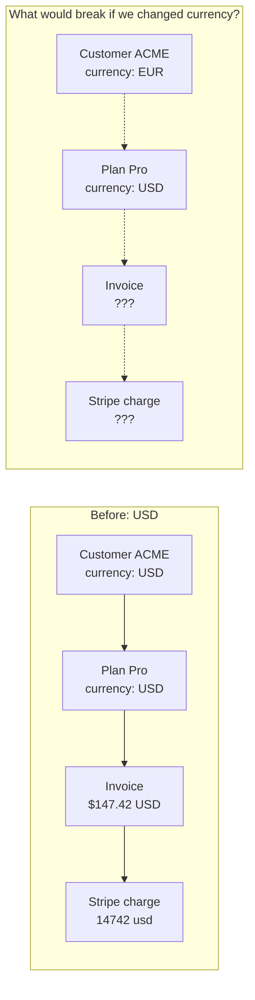

# QBill — Currency & Multi-Currency Explained

**Date:** 2026-07-17
**Scenario Questions:**
1. "I bill in USD based on usage. How does invoice + Stripe payment work?"
2. "If I have USD and want to change to EUR, how does pricing change?"
3. "If I'm in INR and want to change to USD or EUR, how does the billing portal work?"

---

## Table of Contents

1. [Current QBill Currency Architecture](#1-current-qbill-currency-architecture)
2. [Scenario 1: Basic USD Billing (How It Works Today)](#2-scenario-1-basic-usd-billing-how-it-works-today)
3. [Scenario 2: Changing Customer Currency (USD → EUR)](#3-scenario-2-changing-customer-currency-usd--eur)
4. [Scenario 3: Multi-Currency Across Customers (INR ↔ USD ↔ EUR)](#4-scenario-3-multi-currency-across-customers-inr--usd--eur)
5. [How Stripe Handles Currency](#5-how-stripe-handles-currency)
6. [What QBill Does Today vs What's Needed](#6-what-qbill-does-today-vs-whats-needed)
7. [Recommended Architecture for Full Multi-Currency](#7-recommended-architecture-for-full-multi-currency)
8. [Quick Reference: Currency Decision Matrix](#8-quick-reference-currency-decision-matrix)

---

## 1. Current QBill Currency Architecture

### Current Rules (BILLING_MATH.md X-1, X-2)

```
X-1: One currency per customer
     Set at customer creation.
     IMMUTABLE while any subscription is active.
     Billing groups require uniform currency across members.

X-2: No FX inside the engine
     Rates are defined per currency in rate cards.
     The engine NEVER converts currencies.
     billing.currency_config.exchange_rates = DISPLAY ONLY
     (dashboards, platform analytics roll-ups only)
```

### Where Currency Is Stored

| Entity | Field | Set When | Can Change? |
|---|---|---|---|
| **Organization** | `currency` | Creation (default: USD) | ✅ Yes (org-level default) |
| **Customer** | `currency` | Customer creation | ❌ **No** while active subscription exists |
| **Plan** | `currency` | Plan creation | ❌ **No** — create new plan for new currency |
| **Invoice** | `currency` | Invoice generation | Inherited from subscription/customer |
| **Wallet** | `currency` | Wallet creation | ❌ **No** — one wallet per currency per customer |
| **Payment** | `currency` | Payment recording | Matches invoice currency |
| **Credit Note** | `currency` | Credit note creation | Matches source invoice |
| **Revenue Recognition** | `currency` | Entry creation | Inherited from source |
| **Billing Group** | `currency` | Group creation | Nullable; derived from paying customer |
| **Currency Config** | `baseCurrency`, `exchangeRates` | Org setup | Display only |

### Critical Limitation

> **The engine never converts currencies.** If a customer's currency is USD, all their plans, invoices, and payments are in USD. To bill in EUR, you create a separate plan priced in EUR and assign it to a customer whose currency is EUR.

---

## 2. Scenario 1: Basic USD Billing (How It Works Today)

### Flow: Usage → Invoice → Stripe Payment

```
Step 1: Customer created with currency = USD
        POST /customers { name: "ACME", currency: "USD" }

Step 2: Plan created with currency = USD
        POST /plans { name: "Pro", currency: "USD", base_amount: "99.00" }

Step 3: Subscription created (customer ACME → Plan Pro)
        POST /subscriptions { customer_id: "...", plan_id: "..." }

Step 4: Usage events flow in — tracked in Redis counters
        POST /events { tokens: 150000, model: "gpt-4" }
        │
        ▼
Step 5: Subscription anniversary → Invoice generated
        invoice.Generate() produces:
        ┌─────────────────────────────────────┐
        │ INV-2026-001                         │
        │ Customer: ACME                      │
        │ Currency: USD                        │
        │                                      │
        │ BASE_FEE         $99.00              │
        │ USAGE (150K tok)  $37.50             │
        │ OVERAGE          $0.00               │
        │ ─────────────────────────────────── │
        │ Subtotal         $136.50             │
        │ Credits applied  $0.00               │
        │ Tax (8%)         $10.92              │
        │ TOTAL            $147.42             │
        └─────────────────────────────────────┘
        │
        ▼
Step 6: Invoice finalized → Auto-collection triggered
        │
        ▼
Step 7: Stripe PaymentIntent created
        Stripe API: POST /payment_intents
        {
          amount: 14742,        ← cents (147.42 × 100)
          currency: "usd",      ← lowercase ISO 4217
          customer: "cus_xxx",
          payment_method: "pm_xxx"
        }
        │
        ▼
Step 8: Payment succeeds → Invoice status: paid
```

### Key Points About This Flow

1. **Amount in cents**: Stripe expects amounts in minor currency units (cents for USD)
2. **Currency code**: Stripe expects lowercase ISO 4217 (`usd`, not `USD`)
3. **Same currency end-to-end**: Customer currency = Plan currency = Invoice currency = Stripe charge currency
4. **No conversion needed**: Everything is in USD from start to finish

### Prisma Schema for Invoice Currency

```prisma
model Invoice {
  id       String   // UUID
  currency String   // ISO 4217 code, e.g. "USD", "EUR"
  subtotal Decimal  // at currency minor-unit precision
  total    Decimal  // at currency minor-unit precision
  // ...
}
```

### Stripe Integration Code (Engine)

The Go engine's collection module creates Stripe PaymentIntents using the invoice's currency:
```go
func (c *Collector) charge(ctx context.Context, invoice *Invoice) error {
    params := &stripe.PaymentIntentParams{
        Amount:   stripe.Int64(invoice.TotalInCents()), // convert to minor units
        Currency: stripe.String(strings.ToLower(invoice.Currency)), // "usd"
        Customer: stripe.String(invoice.StripeCustomerID),
    }
    // ...
}
```

---

## 3. Scenario 2: Changing Customer Currency (USD → EUR)

### The Problem

**Current rule (X-1):** Customer currency is IMMUTABLE while any subscription is active.

This means: If ACME has an active subscription billed in USD, you CANNOT change their currency to EUR mid-stream.

### Why This Rule Exists



**Problems if currency changes mid-subscription:**

| Issue | Why It Breaks |
|---|---|
| **Plan is in USD, customer is now EUR** | Plan's `base_amount: 99.00` — is that 99 USD or 99 EUR? |
| **Rate cards are in USD** | All meter rates were defined per 1K tokens in USD |
| **Existing invoice amounts** | Previous invoices are in USD; new invoices would be in EUR — inconsistent records |
| **Stripe charges** | Can't charge a mix of USD and EUR on the same subscription |
| **Wallet balance** | Wallet has USD balance; new charges would be in EUR |
| **Credit notes** | Credit notes reference original invoices — currency mismatch |
| **Revenue recognition** | Rev-rec entries have currency — mixing breaks reports |

### How to Change Currency (Current Workaround)

**Step-by-step process to move a customer from USD to EUR:**

```
Phase 1: Lock the customer
─────────────────────────
1. Set customer.subscription.cancel_at_period_end = true
2. Wait for current period to end
3. Final invoice generated (in USD)
4. Payment collected (in USD)

Phase 2: Create EUR infrastructure
──────────────────────────────────
5. Create new Plan "Pro EUR" with currency = EUR, same pricing structure
6. Set up rate cards in EUR
7. Create new Stripe price IDs in EUR

Phase 3: Move customer to EUR
─────────────────────────────
8. Create new subscription for ACME → "Pro EUR" plan
   (Customer currency is no longer locked because old subscription ended)
9. Update customer currency to EUR
10. New invoices now in EUR
11. Stripe charges now in EUR

Phase 4: Handle the transition (if needed)
─────────────────────────────────────────
12. Any remaining USD credits → apply to final USD invoice
13. New EUR wallet (if any) → starts fresh
14. Rev-rec entries split: USD for past period, EUR for new period
```

### What This Workaround Requires

| Requirement | Status in QBill | Effort |
|---|---|---|
| Multiple plans per currency | ✅ Supported — create "Pro USD" and "Pro EUR" | None |
| Subscription can end naturally | ✅ `cancel_at_period_end` supported | None |
| New subscription in new currency | ✅ New subscription picks up customer's new currency | None |
| Rate cards in multiple currencies | ✅ Supported — rates defined per currency | None |
| **Automated currency migration** | ❌ **Not implemented** — must be done manually | High |
| **Mid-period currency switch** | ❌ **Not supported** — must wait for period end | Not planned |
| **FX rate at transition point** | ❌ **Not supported** — engine does no conversion | Medium |

---

## 4. Scenario 3: Multi-Currency Across Customers (INR ↔ USD ↔ EUR)

### The Real-World Situation

```
Your Platform (QBill)
│
├── Customer A: ACME India
│   ├── Currency: INR
│   ├── Plan: Pro (price in INR)
│   ├── Invoice: ₹12,000
│   └── Stripe: charges in inr
│
├── Customer B: ACME Europe
│   ├── Currency: EUR
│   ├── Plan: Pro (price in EUR)
│   ├── Invoice: €149.00
│   └── Stripe: charges in eur
│
└── Customer C: ACME USA
    ├── Currency: USD
    ├── Plan: Pro (price in USD)
    ├── Invoice: $147.42
    └── Stripe: charges in usd
```

### How It Works Today

Each customer operates in their own currency independently:

| Customer | Currency | Plan | Invoice | Stripe | Exchange Rate Needed? |
|---|---|---|---|---|---|
| ACME India | INR | Pro INR (₹999/mo) | ₹12,000 | inr | **No** — all in INR |
| ACME Europe | EUR | Pro EUR (€99/mo) | €149.00 | eur | **No** — all in EUR |
| ACME USA | USD | Pro USD ($99/mo) | $147.42 | usd | **No** — all in USD |

**Important:** Each currency requires a SEPARATE plan. There is no "master pricing in USD that converts to INR/EUR."

### What You Need to Create for Each Currency

```
For USD customers:                    For EUR customers:
────────────────────                  ────────────────────
Plan "Pro USD"                        Plan "Pro EUR"
├── base_amount: "99.00"              ├── base_amount: "99.00"
├── currency: "USD"                   ├── currency: "EUR"
├── charges:                          ├── charges:
│   └── PER_UNIT: 0.025 per 1K tokens │   └── PER_UNIT: 0.025 per 1K tokens
└── rate cards in USD                 └── rate cards in EUR

For INR customers:
────────────────────
Plan "Pro INR"
├── base_amount: "8200.00"         ← manually set INR price
├── currency: "INR"
├── charges:
│   └── PER_UNIT: 2.00 per 1K tokens  ← manually set INR rate
└── rate cards in INR
```

**The manual effort:** You must create each plan in each currency with manually converted prices. There is NO auto-conversion.

### Dashboard / Billing Portal Display

```
Organization Dashboard (platform admin)
┌────────────────────────────────────────────────────────┐
│ Revenue Overview                                       │
│                                                        │
│ Total Revenue (display only — converted via            │
│ currency_config.exchange_rates):                       │
│   $45,230 USD  |  €38,900 EUR  |  ₹3,200,000 INR      │
│                                                        │
│ Exchange Rates (from billing.currency_config):         │
│   1 USD = 0.92 EUR (display only — NOT used for billing)│
│   1 USD = 83.50 INR (display only — NOT used for billing)│
└────────────────────────────────────────────────────────┘

Customer Billing Portal (ACME India)
┌────────────────────────────────────────┐
│ Your Invoices                          │
│                                        │
│ INV-2026-001    ₹12,000    Paid        │
│ INV-2026-002    ₹11,500    Pending     │
│                                        │
│ All amounts are in INR                 │
└────────────────────────────────────────┘
```

---

## 5. How Stripe Handles Currency

### Stripe's Currency Model

Stripe supports **136 currencies** but has important rules:

| Rule | Detail |
|---|---|
| **Account currency** | Stripe account has a `default_currency` (set at account creation) |
| **Charge currency** | Each PaymentIntent can be in ANY supported currency |
| **Settlement** | Stripe auto-converts to your account currency at settlement |
| **Conversion fee** | 1% FX conversion fee for non-default currency charges |
| **Payout** | Payouts are in account currency (after conversion) |

### Stripe Currency Flow

```
Customer pays in EUR
         │
         ▼
Stripe PaymentIntent: 14900 eur
         │
         ▼
Stripe converts EUR → USD (1% FX fee)
         │
         ▼
Your Stripe account settled in USD
$162.00 → minus 1% FX fee → $160.38
         │
         ▼
Payout to your bank account in USD
```

### What This Means for QBill

| Scenario | Currency in Stripe | Settlement | FX Cost |
|---|---|---|---|
| USD customer → USD charge | `usd` | USD (no conversion) | 0% |
| EUR customer → EUR charge | `eur` | USD (auto-converted) | 1% |
| INR customer → INR charge | `inr` | USD (auto-converted) | 1% |

**QBill's current approach** matches Stripe's model: charge in the customer's currency, let Stripe handle conversion to your settlement currency.

---

## 6. What QBill Does Today vs What's Needed

### What Works Today

| Capability | Status | Notes |
|---|---|---|
| Per-customer currency | ✅ Supported | Set at customer creation |
| Per-plan currency | ✅ Supported | Create separate plans per currency |
| Invoices in customer currency | ✅ Supported | Invoice inherits customer/subscription currency |
| Stripe charges in correct currency | ✅ Supported | Engine handles lowercase ISO conversion |
| Display-only FX conversion | ✅ Supported | `currency_config.exchange_rates` for dashboards |
| Revenue recognition per currency | ✅ Supported | Rev-rec entries stamped with currency |
| Multi-currency dashboards | ✅ Supported | Analytics grouped by currency |

### What Does NOT Work Today

| Capability | Status | Why It's Missing |
|---|---|---|
| **Change customer currency mid-subscription** | ❌ **Not supported** | X-1 rule — immutable while subscription active |
| **Auto-convert plan prices between currencies** | ❌ **Not supported** | Each currency requires manually created plans |
| **FX conversion in billing engine** | ❌ **Not supported** | X-2 rule — engine never converts |
| **Single "master" plan with multi-currency pricing** | ❌ **Not supported** | Requires separate plans per currency |
| **Invoice with mixed currencies** | ❌ **Not supported** | Each invoice is single-currency |
| **Real-time FX rates** | ❌ **Not supported** | Exchange rates are manual/managed |

### The Gap: No Multi-Currency Pricing Engine

```
What QBill has:                    What's missing:
─────────────────                   ────────────────
Plan "Pro USD"                      Master Price List:
  base_amount: 99.00 USD            ├── Standard: $99 USD
  per_1K_tokens: 0.025 USD          ├── EUR: €92 = convert($99 × 0.93)
                                    ├── INR: ₹8,267 = convert($99 × 83.50)
Plan "Pro EUR"                      └── Auto-create plans in each currency
  base_amount: 99.00 EUR            └── Auto-update when FX rates change
  per_1K_tokens: 0.025 EUR
                                   
Plan "Pro INR"                      
  base_amount: 8200.00 INR          
  per_1K_tokens: 2.00 INR          
```

---

## 7. Recommended Architecture for Full Multi-Currency

### Option A: Current Approach — Manual Multi-Currency (Simplest)

Keep QBill's current approach but add tooling to manage it:

```
1. Create a "master price" in a base currency (e.g., USD)
2. Create a script that:
   a. Reads current FX rates from an API
   b. Creates/updates plans in each currency
   c. Converts prices: EUR_price = USD_price × EUR_rate
3. Run the script whenever rates change (daily or weekly)

Pros:  No engine changes needed
Cons:  Manual, potential for stale rates, plan proliferation
```

### Option B: Multi-Currency Plan with Currency Conversion (Medium)

Add a "multi-currency flag" to plans:

```
Plan "Pro" (multi-currency: true)
├── base_prices:
│   ├── USD: 99.00
│   ├── EUR: 92.00    ← set manually or via FX rate
│   └── INR: 8267.00  ← set manually or via FX rate
├── rate_prices:
│   ├── USD: 0.025 per 1K tokens
│   ├── EUR: 0.023 per 1K tokens
│   └── INR: 2.00 per 1K tokens
└── when customer subscribes:
    └── pick the price matching customer.currency
```

**What needs to change in QBill:**
1. Allow plans to define prices in multiple currencies
2. At subscription time, select the matching currency price
3. Invoice engine uses the selected currency price
4. No actual FX conversion — still the same "one currency per customer" model

**Pros:** Single plan template, cleaner management, no FX risk
**Cons:** Still requires manual price setting per currency

### Option C: Full FX Engine (Most Complex — Not Recommended)

Add actual FX conversion inside the billing engine:

```
When invoice is generated in EUR but pricing is in USD:
  1. Look up USD price
  2. Look up EUR/USD FX rate from currency_config
  3. Convert: EUR_amount = USD_price × FX_rate
  4. Round to EUR minor units
  5. Create invoice in EUR
```

**Not recommended because:**
- X-2 was a deliberate decision to avoid FX complexity
- FX rates fluctuate — invoices become non-reproducible
- Customers prefer fixed prices in their own currency
- Stripe already handles FX at settlement
- Adds significant testing and compliance burden

### Recommended: Option B

The recommended approach is **Option B** — multi-currency plan with per-currency prices:

```
Plan "Pro"
├── is_multi_currency: true
├── base_prices: [
│     { currency: "USD", amount: "99.00" },
│     { currency: "EUR", amount: "92.00" },
│     { currency: "INR", amount: "8267.00" },
│     { currency: "GBP", amount: "79.00" }
│   ]
├── rate_prices: [
│     { currency: "USD", model: "gpt-4", token_type: "input", rate: "0.000025" },
│     { currency: "EUR", model: "gpt-4", token_type: "input", rate: "0.000023" },
│     { currency: "INR", model: "gpt-4", token_type: "input", rate: "0.002000" }
│   ]
└── fx_auto_update: true  ← optional: auto-update from FX API
```

**Changes needed in QBill:**

| Component | Change | Effort |
|---|---|---|
| **Prisma schema** | Add `is_multi_currency` to Plan; change `currency` to `CurrencyPrice[]` | 1 sprint |
| **Catalog service** | Support multi-currency plan creation with per-currency prices | 1 sprint |
| **Rating engine** | Look up rate by `(meter, model, token_type, customer_currency)` | 1-2 sprints |
| **Invoice generation** | Use customer currency throughout | ✅ Already works |
| **Stripe integration** | Already handles per-currency charges | ✅ Already works |
| **FX rate sync** | Add optional automatic FX rate refresh from provider API | 1 sprint |
| **Customer currency change** | Allow change at period boundary (instead of blocking) | 1 sprint |
| **Admin UI** | Display prices in all currencies | 1 sprint |

---

## 8. Quick Reference: Currency Decision Matrix

| You Want To... | Current QBill | What You Need |
|---|---|---|
| **Bill a customer in USD** | ✅ Works today — create customer with currency=USD, plan with currency=USD | Nothing |
| **Bill a customer in EUR** | ✅ Works today — create customer with currency=EUR, plan with currency=EUR | Create separate EUR plan manually |
| **Bill 100 customers in 5 currencies** | ✅ Works — 5 plans (one per currency), 100 customers assigned accordingly | Create and maintain 5 plans |
| **Change customer USD → EUR mid-subscription** | ❌ **Not possible** — must wait for period end, create new subscription | Manual process (see §3 workaround) |
| **Auto-convert prices between currencies** | ❌ **Not possible** — each plan priced manually per currency | Option B architecture change |
| **Dashboard showing total revenue in USD across all currencies** | ✅ Works — `currency_config.exchange_rates` for display-only conversion | Nothing |
| **Customer portal shows amounts in INR** | ✅ Works — invoice is in customer's currency | Nothing |
| **One "master" plan that works in any currency** | ❌ **Not possible** — need separate plans per currency | Option B architecture change |
| **Change pricing in USD and have EUR/INR auto-update** | ❌ **Not possible** — must update each plan manually | Option B + FX auto-sync |
| **Invoice with mixed currencies (partial USD + partial EUR)** | ❌ **Not supported** — single currency per invoice | Not recommended — violates accounting principles |

---

## Summary

| Scenario | Status |
|---|---|
| **"I bill in USD for usage → generate invoice → Stripe payment"** | ✅ **Works perfectly today** — end-to-end single currency flow |
| **"I want to change from USD to EUR"** | ⚠️ **Possible but manual** — must wait for period end, create new EUR plan, move customer |
| **"I have customers in INR, USD, EUR all at once"** | ✅ **Works** — each customer in their own currency, separate plans per currency |
| **"I want one plan template that auto-prices in any currency"** | ❌ **Not supported** — requires Option B architecture change |

---

*End of document. Generated 2026-07-17.*
